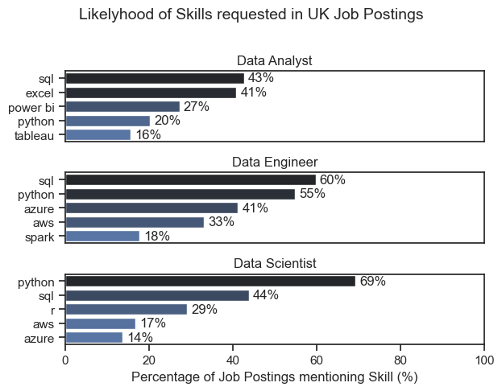

# 1) Skill Frequency & Importance in UK Data Roles
_Notebook: `2_Project/02.Skill_Count.ipynb`_

This notebook analyzes **UK job postings** for data roles to identify the most requested skills.  
It calculates the **percentage of postings mentioning each skill** and plots the Top skills per role.

---

## 1. Imports and Theme

We import the main Python libraries for data manipulation, visualization, and dataset loading.  
Seaborn’s theme is set for clean and consistent styling.

```python
import pandas as pd
import matplotlib.pyplot as plt
import seaborn as sns
from datasets import load_dataset
import ast

sns.set_theme(style="ticks", context="notebook")
```

## 2. Load Dataset

The dataset comes from Hugging Face (lukebarousse/data_jobs).
It is converted into a pandas DataFrame for processing.

```python
dataset = load_dataset("lukebarousse/data_jobs")
df = pd.DataFrame(dataset['train'])
```

## 3. Clean Columns

The job_posted_date is converted to datetime.
The job_skills column, originally stored as strings, is turned into real Python lists.

```python 
df["job_posted_date"] = pd.to_datetime(df["job_posted_date"])
df['job_skills'] = df['job_skills'].apply(lambda skill_list: ast.literal_eval(skill_list) if pd.notna(skill_list) else skill_list)
```
Example:
**"['Python','SQL']"** → **['Python','SQL']**

## 4. Filter to UK Roles

We only keep job postings from the United Kingdom.

```python
df = df[df["job_country"] == "United Kingdom"]
```

## 5.Explode Skills
Each job posting with multiple skills is “exploded” so every (job_id, skill) pair becomes its own row.
This makes it easier to count skill frequencies.
```python
df_skills = df_UK.explode('job_skills')
```

## 6. Count Skills per Role

We count how many unique postings mention each skill, grouped by job title.

```python
df_skill_counts = (
    df_skill_counts =
    df_skills.groupby(['job_title_short', 'job_skills']).size().reset_index(name='skill_count')
)
```

## 7. Normalize to Percentages

To compare fairly across roles, we calculate the percentage of postings mentioning each skill.
This is done by dividing skill counts by the total postings per role.

```python
title_totals = (
    df_exploded.groupby("job_title_short")["job_id"]
    .nunique()
    .rename("total_postings")
    .reset_index()
)

df_skills_perc = (
    df_skill_counts.merge(title_totals, on="job_title_short")
    .assign(skill_percentage=lambda d: 100*d["skill_count"]/d["total_postings"])
    .sort_values(["job_title_short","skill_percentage"], ascending=[True,False])
)
```

## 8. Plot Top-5 Skills per Role

For each job title, we select the top 5 skills and plot them using horizontal bar charts.
The y-axis is inverted so that the most requested skill appears at the top.
Percentage labels are added directly to the bars.

```python
fig, ax = plt.subplots(len(job_titles), 1)

sns.set_theme(style='ticks')

for i, job_title in enumerate(job_titles):
    df_plot = df_skills_perc[df_skills_perc['job_title_short'] == job_title].head(5)
    # df_plot.plot(kind='barh', x='job_skills', y= 'skill_percentage', ax=ax[i], legend=False, title=job_title)
    sns.barplot(data=df_plot, x='skill_percentage', y='job_skills', ax=ax[i], hue= 'skill_count', palette = 'dark:b_r')
    ax[i].set_title(job_title)
    # ax[i].invert_yaxis()
    ax[i].set_ylabel('')
    ax[i].get_legend().remove()
    ax[i].set_xlim(0, 100)
    ax[i].set_xlabel('')
    if i == 2:
        ax[i].set_xlabel('Percentage of Job Postings mentioning Skill (%)')
        
    for n, v in enumerate(df_plot['skill_percentage']):
        ax[i].text(v + 1, n, f'{v:.0f}%', va='center')
    
    if i != len(job_titles) - 1:
        ax[i].set_xticks([])


fig.suptitle('Likelyhood of Skills requested in UK Job Postings', y=1.01, fontsize=14)
fig = plt.tight_layout()
plt.show()
```

## 9. Results (Interpretation)




Data Analyst → SQL and Excel dominate; BI tools (Tableau, Power BI) follow.

Data Scientist → Python is strongest; ML libraries and SQL also rank high.

Data Engineer → SQL, Python, Spark, and cloud data tools are most common.

The percentages represent how likely a skill is to appear in postings for a given role.

# 2) In-demand skills trending for Data Engineers

