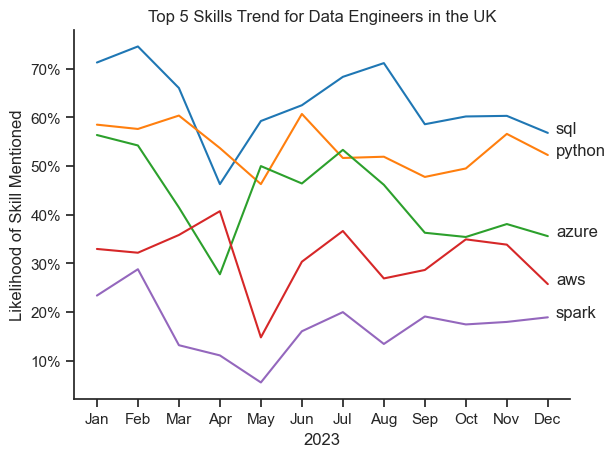

# 1) Skill Frequency & Importance in UK Data Roles
_Notebook: `2_Project/02.Skill_Count.ipynb`_

This notebook analyzes **UK job postings** for data roles to identify the most requested skills.  
It calculates the **percentage of postings mentioning each skill** and plots the Top skills per role.

---

## 1. Imports and Theme

We import the main Python libraries for data manipulation, visualization, and dataset loading.  
Seaborn’s theme is set for clean and consistent styling.

```python
import pandas as pd
import matplotlib.pyplot as plt
import seaborn as sns
from datasets import load_dataset
import ast

sns.set_theme(style="ticks", context="notebook")
```

## 2. Load Dataset

The dataset comes from Hugging Face (lukebarousse/data_jobs).
It is converted into a pandas DataFrame for processing.

```python
dataset = load_dataset("lukebarousse/data_jobs")
df = pd.DataFrame(dataset['train'])
```

## 3. Clean Columns

The job_posted_date is converted to datetime.
The job_skills column, originally stored as strings, is turned into real Python lists.

```python 
df["job_posted_date"] = pd.to_datetime(df["job_posted_date"])
df['job_skills'] = df['job_skills'].apply(lambda skill_list: ast.literal_eval(skill_list) if pd.notna(skill_list) else skill_list)
```
Example:
**"['Python','SQL']"** → **['Python','SQL']**

## 4. Filter to UK Roles

We only keep job postings from the United Kingdom.

```python
df = df[df["job_country"] == "United Kingdom"]
```

## 5.Explode Skills
Each job posting with multiple skills is “exploded” so every (job_id, skill) pair becomes its own row.
This makes it easier to count skill frequencies.
```python
df_skills = df_UK.explode('job_skills')
```

## 6. Count Skills per Role

We count how many unique postings mention each skill, grouped by job title.

```python
df_skill_counts = (
    df_skill_counts =
    df_skills.groupby(['job_title_short', 'job_skills']).size().reset_index(name='skill_count')
)
```

## 7. Normalize to Percentages

To compare fairly across roles, we calculate the percentage of postings mentioning each skill.
This is done by dividing skill counts by the total postings per role.

```python
title_totals = (
    df_exploded.groupby("job_title_short")["job_id"]
    .nunique()
    .rename("total_postings")
    .reset_index()
)

df_skills_perc = (
    df_skill_counts.merge(title_totals, on="job_title_short")
    .assign(skill_percentage=lambda d: 100*d["skill_count"]/d["total_postings"])
    .sort_values(["job_title_short","skill_percentage"], ascending=[True,False])
)
```

## 8. Plot Top-5 Skills per Role

For each job title, we select the top 5 skills and plot them using horizontal bar charts.
The y-axis is inverted so that the most requested skill appears at the top.
Percentage labels are added directly to the bars.

```python
fig, ax = plt.subplots(len(job_titles), 1)

sns.set_theme(style='ticks')

for i, job_title in enumerate(job_titles):
    df_plot = df_skills_perc[df_skills_perc['job_title_short'] == job_title].head(5)
    # df_plot.plot(kind='barh', x='job_skills', y= 'skill_percentage', ax=ax[i], legend=False, title=job_title)
    sns.barplot(data=df_plot, x='skill_percentage', y='job_skills', ax=ax[i], hue= 'skill_count', palette = 'dark:b_r')
    ax[i].set_title(job_title)
    # ax[i].invert_yaxis()
    ax[i].set_ylabel('')
    ax[i].get_legend().remove()
    ax[i].set_xlim(0, 100)
    ax[i].set_xlabel('')
    if i == 2:
        ax[i].set_xlabel('Percentage of Job Postings mentioning Skill (%)')
        
    for n, v in enumerate(df_plot['skill_percentage']):
        ax[i].text(v + 1, n, f'{v:.0f}%', va='center')
    
    if i != len(job_titles) - 1:
        ax[i].set_xticks([])


fig.suptitle('Likelyhood of Skills requested in UK Job Postings', y=1.01, fontsize=14)
fig = plt.tight_layout()
plt.show()
```

## 9. Results (Interpretation)


Data Analyst → SQL and Excel dominate; BI tools (Tableau, Power BI) follow.

Data Scientist → Python is strongest; ML libraries and SQL also rank high.

Data Engineer → SQL, Python, Spark, and cloud data tools are most common.

The percentages represent how likely a skill is to appear in postings for a given role.


# 2) In-demand Skills Trending for Data Engineers
_Notebook: `2_Project/03.Skills_Trend.ipynb`_

This notebook focuses exclusively on **Data Engineer** roles to explore which skills are **gaining the most traction over time** in the UK job market.  
It builds upon the previous analysis of overall skill frequency by adding a **time dimension**, allowing us to track how demand for specific technologies has evolved.

---

## 1. Imports and Theme

We import the same Python libraries for consistency and set Seaborn’s theme for visualization.

```python
import pandas as pd
import matplotlib.pyplot as plt
import seaborn as sns
from datasets import load_dataset
import ast


```
## 2. Load and Prepare Data

The dataset used is again from Hugging Face (lukebarousse/data_jobs) and loaded into a pandas DataFrame.
We filter the dataset to include only Data Engineer roles in the United Kingdom.

```python
dataset = load_dataset("lukebarousse/data_jobs")
df = pd.DataFrame(dataset['train'])

df["job_posted_date"] = pd.to_datetime(df["job_posted_date"])
df["job_skills"] = df["job_skills"].apply(lambda s: ast.literal_eval(s) if pd.notna(s) else s)

df_UK = df[df["job_country"] == "United Kingdom"]
df_DE = df_UK[df_UK["job_title_short"] == "Data Engineer"]
```

## 3. Extract Skills Over Time

To see trends, we focus on when skills were mentioned in postings.
We use the posting date to track changes and group data by both skill and time period.

```python
df_explode = df_DE.explode("job_skills")
df_explode["month_year"] = df_explode["job_posted_date"].dt.to_period("M")

df_trend = (
    df_explode.groupby(["month_year", "job_skills"])["job_id"]
    .nunique()
    .reset_index(name="postings")
)
```

## 4. Filter and Calculate Percentages

We calculate how often each skill appears in a given month relative to all Data Engineer postings.

```python
monthly_totals = (
    df_explode.groupby("month_year")["job_id"]
    .nunique()
    .rename("total_jobs")
    .reset_index()
)

df_trend = (
    df_trend.merge(monthly_totals, on="month_year")
    .assign(skill_percentage=lambda d: 100 * d["postings"] / d["total_jobs"])
)

```

## 5. Select Top Skills

We select only the most frequent skills over the entire time range, keeping the top 10 for clarity in visualization.

```python
top_skills = (
    df_trend.groupby("job_skills")["postings"].sum()
    .sort_values(ascending=False)
    .head(10)
    .index
)

df_top_trend = df_trend[df_trend["job_skills"].isin(top_skills)]

```

## 6. Plot Trends Over Time

We visualize how these top 10 skills have changed in popularity across months.
A line chart shows which technologies are gaining or losing traction.

```python
df_plot = df_DE_UK_perc.iloc[:, :5]

sns.lineplot(data=df_plot, dashes=False,palette="tab10")
sns.set_theme(style="ticks")
sns.despine()


plt.title('Top 5 Skills Trend for Data Engineers in the UK')
plt.xlabel('2023')
plt.ylabel('Likelihood of Skill Mentioned')
plt.legend().remove()


ax = plt.gca()
ax.yaxis.set_major_formatter(plt.FuncFormatter(lambda y, _: '{:.0f}%'.format(y)))

for i in range(5):
    plt.text(11.2, df_plot.iloc[-1, i], df_plot.columns[i])

```

## 7. Results (Interpretation)



SQL and Python maintain a steady lead as essential foundation skills.

AWS and Azure show a sharp upward trend, reflecting the increasing demand for cloud-based data engineering.

Spark remains a consistent presence due to large-scale data pipeline needs.

Emerging tools like Airflow and Databricks show growing relevance over the months.

This visualization gives a time-aware view of the evolving Data Engineer skill ecosystem, helping identify not just what’s important now, but what’s rising next.